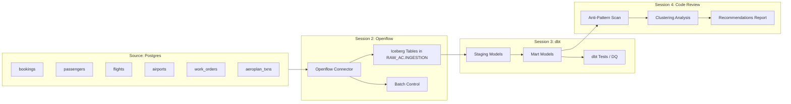

# Plan: Data Engineering HOL Content Rewrite

## Context

The existing codebase at `/Users/sebastien/Repos/ac/ac-coco-de-hol/workshop_guide/` is a Streamlit app that serves as a hands-on lab guide. It uses a consistent component system (`render_prompt`, `render_explanation`, `render_technologies_used`, etc.) and template variables (`{{VAR_NAME}}`). The current content covers Cortex AI Agents; we are replacing it with a Data Engineering lab.

**Domain:** Air Canada / Travel & Hospitality
**Duration:** 2h30
**Source DB:** Pre-provisioned (Postgres) that participants connect to via Openflow
**STTM Format:** JSON (structure TBD — placeholder for now)
**Trial account constraint:** Openflow/SPCS not enabled by default — accounts will be pre-provisioned

### Scenario Narrative

Air Canada's operational systems (reservations, flight ops, maintenance, loyalty) run on a legacy Postgres database. Participants will:
1. Connect to this source via Openflow and land data into Snowflake Iceberg tables following enterprise naming standards
2. Transform the raw data into a dimensional EDW using dbt, driven by a Source-to-Target Mapping (STTM)
3. Use CoCo as a code review agent to optimize the SQL and recommend clustering strategies

### Source Tables (from Postgres)

| Source Table | Description | Target (Iceberg) |
|---|---|---|
| `reservations.bookings` | Flight bookings with PNR, dates, fare class | `RAW_AC.INGESTION.BOOKINGS` |
| `reservations.passengers` | Passenger profiles, loyalty tier | `RAW_AC.INGESTION.PASSENGERS` |
| `flight_ops.flights` | Flight schedule, status, aircraft | `RAW_AC.INGESTION.FLIGHTS` |
| `flight_ops.airports` | Airport reference (IATA, city, timezone) | `RAW_AC.INGESTION.AIRPORTS` |
| `maintenance.work_orders` | Aircraft maintenance events | `RAW_AC.INGESTION.WORK_ORDERS` |
| `loyalty.aeroplan_txns` | Aeroplan points earned/redeemed | `RAW_AC.INGESTION.AEROPLAN_TXNS` |

### EDW Target (from STTM)

| Target Table | Type | Sources |
|---|---|---|
| `EDW_AC.MARTS.DIM_PASSENGER` | SCD Type 2 | passengers, aeroplan_txns |
| `EDW_AC.MARTS.DIM_AIRPORT` | Reference | airports |
| `EDW_AC.MARTS.DIM_AIRCRAFT` | Reference | flights (distinct) |
| `EDW_AC.MARTS.FACT_BOOKING` | Transaction | bookings, flights, passengers |
| `EDW_AC.MARTS.FACT_FLIGHT_OPS` | Periodic snapshot | flights, work_orders |

---

## Implementation Steps

### 1. Update scaffolding pages

**Files:** [home.py](workshop_guide/app_pages/home.py), [agenda.py](workshop_guide/app_pages/agenda.py), [getting_started.py](workshop_guide/app_pages/getting_started.py)

- **home.py**: Replace scenario with Air Canada narrative. Update "What we're building" to reflect the 5 sessions (Ingestion → EDW → Code Review). Update prerequisites to mention Openflow being pre-enabled.
- **agenda.py**: Update session titles and "What you'll build" table (Iceberg tables, dbt models, recommendations report). Keep template variables for times/durations.
- **getting_started.py**: Add Step 4 for verifying Openflow is enabled (or note it's pre-provisioned). Remove cross-region inference step (not needed for this lab).

### 2. Rewrite Session 1: Environment Setup (15 min)

**File:** [session_01.py](workshop_guide/app_pages/session_01.py)

3 prompts:
- **Prompt 1.1** — Create databases (`RAW_AC`, `EDW_AC`), schemas (`INGESTION`, `STAGING`, `MARTS`), warehouse (`AC_DE_WH`)
- **Prompt 1.2** — Verify Openflow runtime is running, list available connectors
- **Prompt 1.3** — Create the batch control table (`RAW_AC.INGESTION.BATCH_CONTROL`) with columns: batch_id, source_table, start_ts, end_ts, rows_loaded, status

Technologies: Openflow Runtime, Iceberg Tables, Batch Control Pattern

### 3. Write Session 2: Enterprise Ingestion with Openflow (40 min)

**File:** [session_02.py](workshop_guide/app_pages/session_02.py)

3 prompts:
- **Prompt 2.1** — Create the Openflow connector to the source Postgres. CoCo should generate the connector configuration with: source connection details (provided as template vars), target database/schema, and enterprise naming convention (source `schema.table` → target `UPPER(TABLE)` in `RAW_AC.INGESTION`).
- **Prompt 2.2** — Configure Iceberg table creation for each source table. The prompt instructs CoCo to: read the source schema, create Iceberg tables in `RAW_AC.INGESTION` with proper types, add audit columns (`_LOADED_AT`, `_BATCH_ID`, `_SOURCE_SYSTEM`), and apply the naming standard.
- **Prompt 2.3** — Start the ingestion, monitor progress, update batch control table with results. Verify row counts match source.

Technologies: Openflow Connectors, Apache Iceberg, Enterprise Naming Standards

### 4. Write Session 3: EDW Pipeline from STTM with dbt (45 min)

**File:** [session_03.py](workshop_guide/app_pages/session_03.py)

3 prompts:
- **Prompt 3.1** — Present the STTM (JSON) to CoCo and ask it to: parse the mappings, generate a dbt project structure with staging models (1:1 from raw) and mart models (dimensional transformations). The STTM will be provided as a template variable `{{STTM_JSON}}` or inline JSON block.
- **Prompt 3.2** — Ask CoCo to generate dbt tests: `not_null` and `unique` on primary keys, `accepted_values` on status columns, `relationships` for FK integrity between facts and dims. Include a custom data quality test (e.g., booking date must be before flight date).
- **Prompt 3.3** — Execute the dbt pipeline (`dbt run` + `dbt test`), review results, produce a DQ summary report showing pass/fail counts and any failures.

Technologies: dbt Core, Source-to-Target Mapping, Data Quality Testing

### 5. Write Session 4: Code Review & Optimization (35 min)

**File:** [session_04.py](workshop_guide/app_pages/session_04.py)

3 prompts:
- **Prompt 4.1** — Ask CoCo to review the generated dbt SQL models for: SQL anti-patterns (SELECT *, implicit type casts, non-sargable predicates, cartesian join risks), coding standards (CTE naming, column ordering, documentation), and Snowflake-specific best practices.
- **Prompt 4.2** — Ask CoCo to analyze the query profiles from the dbt run: identify spilling, poor partition pruning, and recommend clustering keys for the fact tables based on typical query patterns (date range + route + passenger lookups).
- **Prompt 4.3** — Ask CoCo to produce a consolidated recommendations report: prioritized list of changes with impact assessment (high/medium/low), specific ALTER TABLE statements for clustering, and refactored SQL for the top 3 issues found.

Technologies: Query Profile Analysis, Clustering Keys, SQL Anti-Pattern Detection

### 6. Write Session 5: Data Engineer Skill — Stretch (15 min)

**File:** [session_05.py](workshop_guide/app_pages/session_05.py)

2 prompts:
- **Prompt 5.1** — Ask CoCo to package the code review workflow from Session 4 into a reusable CoCo skill: define the skill's trigger phrases, inputs (dbt project path or SQL file), and output format (structured recommendations).
- **Prompt 5.2** — Test the skill by running it against a different model and verify it produces consistent, useful output.

Technologies: CoCo Skills, Workflow Automation, Reusable Patterns

### 7. Update components.py and streamlit_app.py

**File:** [components.py](workshop_guide/components.py)

Update `SESSION_PROMPTS`:
```python
SESSION_PROMPTS = {
    1: ["Prompt 1.1", "Prompt 1.2", "Prompt 1.3"],
    2: ["Prompt 2.1", "Prompt 2.2", "Prompt 2.3"],
    3: ["Prompt 3.1", "Prompt 3.2", "Prompt 3.3"],
    4: ["Prompt 4.1", "Prompt 4.2", "Prompt 4.3"],
    5: ["Prompt 5.1", "Prompt 5.2"],
}
```

**File:** [streamlit_app.py](workshop_guide/streamlit_app.py)

Update navigation groups:
```python
st.navigation({
    "": [Home, Getting Started, Agenda],
    "Block 1: Ingestion": [
        Session 1 (Environment Setup),
        Session 2 (Enterprise Ingestion),
    ],
    "Block 2: EDW & Optimization": [
        Session 3 (EDW Pipeline),
        Session 4 (Code Review),
        Session 5 (DE Skill - Stretch),
    ],
})
```

Remove `session_06.py` (not needed — lab is 5 sessions).

### 8. Template Variables

New variables needed (to be defined in README / generate-hol skill):

| Variable | Purpose | Example |
|---|---|---|
| `{{SOURCE_HOST}}` | Postgres hostname | `ac-source-db.us-east-1.rds.amazonaws.com` |
| `{{SOURCE_PORT}}` | Postgres port | `5432` |
| `{{SOURCE_DB}}` | Source database name | `aircanada_ops` |
| `{{SOURCE_SCHEMA_LIST}}` | Schemas to replicate | `reservations, flight_ops, maintenance, loyalty` |
| `{{OPENFLOW_RUNTIME}}` | Runtime name | `AC_OPENFLOW_RT` |
| `{{STTM_JSON}}` | The full STTM document | (provided later) |
| `{{DBT_PROJECT_NAME}}` | dbt project name | `ac_edw` |

---

## Verification

1. Run `streamlit run workshop_guide/streamlit_app.py` and navigate all pages
2. Confirm all 5 sessions render with prompts, explanations, and key concepts
3. Confirm "Done" checkboxes track correctly and green checkmarks appear in sidebar
4. Confirm no broken template variables (all `{{X}}` are intentional placeholders)

---

## Critical Files

- `workshop_guide/app_pages/session_02.py` — Core Openflow ingestion content (most novel)
- `workshop_guide/app_pages/session_03.py` — dbt/STTM pipeline content (most complex)
- `workshop_guide/app_pages/session_04.py` — Code review agent content (most impactful)
- `workshop_guide/app_pages/home.py` — Scenario framing, sets the narrative
- `workshop_guide/streamlit_app.py` — Navigation structure and page registration

---

## Data Flow Diagram


